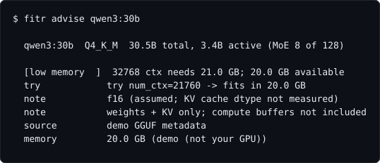
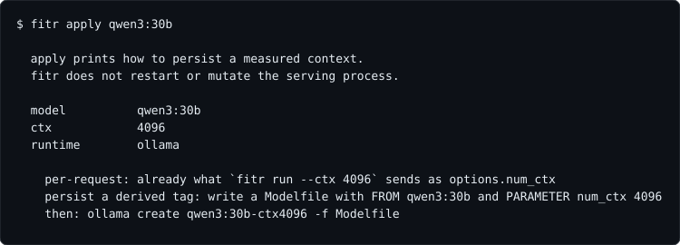
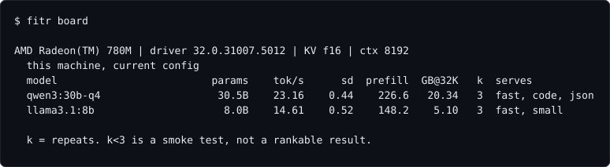

# fitr

**Is this local model any good - on your machine?**

Everyone has this problem. A model is all over your feed. You still do not
know which quant fits in *your* VRAM, or what it actually does on this box
in a benchmark you can compare to the last one you tried. The posts skip the
quant. The leaderboard was someone else's hardware.

```bash
fitr advise some-new-model:tag          # does it fit, which flag if not
fitr run some-new-model:tag --full --pull
fitr apply some-new-model:tag           # print how to persist the measured ctx
fitr board                              # compare everything you have measured
```






One run tells you, for this device and this config:

- **What the model is actually for here** - independent needs with PASS/FAIL
  gates (fast chat, coding, structured output, exact instructions, unattended
  agent work, low refusal, memory footprint), never one number.
- **What is silently broken** - the Q4 that writes clean prose but emits
  malformed tool calls, the parser that swallows them, the loop your GPU
  triggers and nobody else's does. No other harness reports this.
- **How sure to be** - every rate carries its confidence interval, every run
  prints what it cannot resolve, and "cannot separate" is a real answer.

> `llmfit` tells you what fits. Leaderboards tell you what is smart on
> someone else's machine. **`fitr` tells you what is true on yours.**

Single static binary. No Python runtime, no venv, no package manager. Works
against **Ollama, llama.cpp's llama-server, or any OpenAI-compatible server**
(LM Studio, vLLM, SGLang), auto-detected. Paste a Hugging Face GGUF URL and
Ollama pulls it.

Optional sister: [retonr](https://github.com/blisspixel/retonr) reconstructs
drafts in your style under fidelity gates. fitr can export device-measurement
evidence for it (`fitr export <model> --retonr`). **fitr works without
retonr.** The export is not a qualification.

## Install

macOS / Linux:

```bash
curl -fsSL https://raw.githubusercontent.com/blisspixel/fitr/main/install.sh | sh
```

Windows (PowerShell):

```powershell
irm https://raw.githubusercontent.com/blisspixel/fitr/main/install.ps1 | iex
```

Then:

```bash
fitr                             # what this box is, what is already serving
fitr advise qwen3:30b            # does it fit, and if not, which flag to try
fitr run qwen3:30b --ctx 8192 --full
fitr apply qwen3:30b             # print how to persist the measured ctx
fitr board
```

From source (Go 1.25+): `git clone https://github.com/blisspixel/fitr && cd fitr && make install`.
Pin a version with `FITR_VERSION=v0.2.0`, relocate with `FITR_BIN`.

## Commands

| Command | Does |
|---|---|
| `fitr run <model> [--quick\|--full] [-k N] [--ctx N]` | measure a model on this device (~4 to ~18 min by level) |
| `fitr advise <model>` | does it fit here, and if not, which flag to try (`--load` / `--fit` to measure) |
| `fitr apply [model]` | print how to persist a measured context; never restarts the server |
| `fitr tune [a b]` | request-level knobs; fingerprint diff of two saved runs (no silent sweep) |
| `fitr export <model> [--out PATH]` | write a self-contained HTML scorecard (opt-in; contains the fingerprint) |
| `fitr board [--current]` | compare everything, grouped by device |
| `fitr doctor <model>` | can this box be measured fairly at all? (~1 min) |
| `fitr compare <a> <b>` | difference/ratio intervals; paired flips on shared instances |
| `fitr diag <model>` | 5-rung tool-use plumbing diagnostic |
| `fitr device` / `fitr profiles [new]` | fingerprint and gates; `new` scaffolds an UNCALIBRATED local profile |
| `fitr calibrate <a> <b>` | which check items discriminated two paired runs (does not rewrite the spec) |

## Three ideas carry everything

1. **A score is meaningless without the device it was measured on.** Every
   result embeds a hardware/runtime fingerprint, and `board` refuses to rank
   across fingerprints.
2. **Tasks are generated, answers are computed, never stored.** There is no
   answer string in this repo to leak into training data, and every repeat
   is an independent trial.
3. **The statistics are built for n=3 to n=50** - the regime where most
   benchmark statistics quietly stop being true. Wilson and Newcombe
   intervals, Fieller ratios, McNemar paired tests, Wald sequential
   decisions, exact zero-event bounds. Every formula pinned to published
   reference values in tests.

## Documentation

| Doc | Covers |
|---|---|
| [Design](docs/design.md) | the four commitments, the needs, how to read a result, known limits |
| [Statistics](docs/statistics.md) | every method, the rejected alternative, and the references |
| [Task battery](docs/tasks.md) | generated checks with computed answers; your own tasks without forking |
| [Doctor](docs/doctor.md) | determinism, served context, placement, config red flags |
| [Backends](docs/backends.md) | Ollama, llama-server, OpenAI-compatible - and what each can measure honestly |
| [Usage](docs/usage.md) | flags, output modes, exit codes, device profiles |
| [Roadmap](ROADMAP.md) | what is next and why |
| [retonr](docs/retonr.md) | optional sister project; fitr works without it |

Screenshots use demo data and regenerate from the real printers via
`make screenshots`, so they cannot drift from what the tool prints.

## License

MIT
