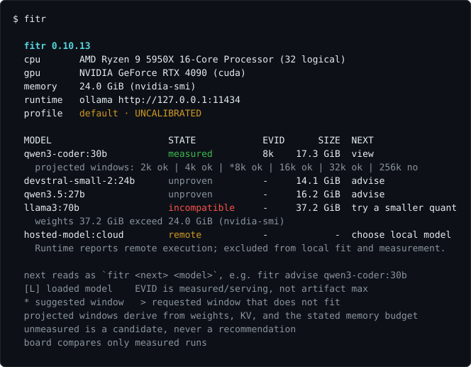

# fitr

[](https://github.com/blisspixel/fitr/actions/workflows/ci.yml)

**Is this local model any good on your machine?**

A new model lands on your feed. The post skipped the quant. The leaderboard
was someone else's GPU. You still do not know whether this artifact fits in
*your* VRAM, or what it actually does on this box.

```bash
fitr                         # what's installed, what's measured, what next
fitr qwen3:30b               # does it fit, and which flag if not
fitr run qwen3:30b --ctx 16384
fitr apply qwen3:30b         # print how to persist that ctx; never restarts the server
fitr board                   # compare only runs this device can honestly compare
fitr top                     # the same loop, full-screen
```




`advise` is the fit verdict. `run` is the measurement. `apply` is the next
flag, written down. `board` refuses to rank across fingerprints. A no always
carries a remedy. INCONCLUSIVE is a real answer. Unmeasured is a candidate,
never a recommendation.

> `llmfit` tells you what fits. Leaderboards tell you what is smart on
> someone else's machine. **`fitr` tells you what is true on yours**, and
> what is quietly wrong.

The default evidence path is one static binary: no Python, venv, or package
manager. Generated-code execution is disabled by default. How backends are
identified, and what stays visible but unrankable, is in
[backends](docs/backends.md). The four commitments behind a scorecard are in
[design](docs/design.md).

## Install

macOS / Linux:

```bash
curl -fsSL https://raw.githubusercontent.com/blisspixel/fitr/main/install.sh | sh
```

Windows (PowerShell):

```powershell
irm https://raw.githubusercontent.com/blisspixel/fitr/main/install.ps1 | iex
```

Pin a release with `FITR_VERSION=v0.9.3`. Relocate with `FITR_BIN`. Installers
bind the downloaded asset to its exact `SHA256SUMS` entry. From source (Go
1.25+): `git clone https://github.com/blisspixel/fitr && cd fitr && make install`.

`--quick` is speed, memory, and plumbing. The default run adds generated
checks, refusal, and tool withdrawal. `--full` is the optional long agent
loop; coding stays SKIP until an isolated worker exists. A default run tells
*broken* from *working*, not 71 from 74.

## Everyday loop

| Command | Does |
|---|---|
| `fitr` | installed models joined to evidence, fit windows, one next command per row |
| `fitr [model]` | named advise: fit verdict plus a context-fit table at 2k-32k |
| `fitr run <model>` | measure it here (`--quick` / default / `--full`) |
| `fitr apply [model]` | print how to persist the measured context |
| `fitr board` / `fitr top` | compare measured runs, or open the full-screen monitor |

Flags, exit codes, doctor, compare, calibrate, and export live in
[usage](docs/usage.md). Terminal views, keys, and the privacy contract are in
[tui.md](docs/tui.md).

## Documentation

| Doc | Covers |
|---|---|
| [Design](docs/design.md) | the four commitments, the needs, how to read a result |
| [Usage](docs/usage.md) | every command, flags, output modes, device profiles |
| [Statistics](docs/statistics.md) | methods, rejected alternatives, references |
| [Task battery](docs/tasks.md) | generated checks; your own tasks without forking |
| [Doctor](docs/doctor.md) | can this box be measured fairly at all? |
| [Backends](docs/backends.md) | Ollama, llama-server, OpenAI-compatible |
| [Calibration](docs/calibration.md) | paired quant protocol and multi-device aggregation |
| [Interface](docs/interface.md) / [TUI](docs/tui.md) | CLI-first data UX and the opt-in monitor |
| [Roadmap](ROADMAP.md) / [release acceptance](docs/release-acceptance.md) | what is next and the native evidence still required |
| [retonr](docs/retonr.md) | optional sister project; fitr works without it |

Screenshots use demo data and regenerate from the real printers via
`make screenshots`. Advise, apply, board, and top views are in
[docs/assets](docs/assets/).

## License

MIT. Dependency licenses are listed in
[THIRD_PARTY_NOTICES.md](THIRD_PARTY_NOTICES.md).
