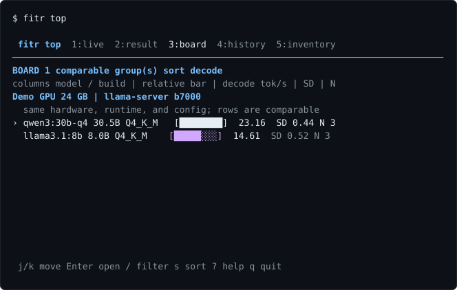

# fitr

[](https://github.com/blisspixel/fitr/actions/workflows/ci.yml)

**Is this local model any good - on your machine?**

Everyone has this problem. A model is all over your feed. You still do not
know which quant fits in *your* VRAM, or what it actually does on this box
in a benchmark you can compare to the last one you tried. The posts skip the
quant. The leaderboard was someone else's hardware.

```bash
fitr advise some-new-model:tag          # does it fit, which flag if not
fitr run some-new-model:tag --full --pull
fitr apply some-new-model:tag           # print how to persist the measured ctx
fitr view                               # reopen the newest result with graphs
fitr board                              # compare everything you have measured
fitr top                                # full-screen Live, Result, Board, and History
```




The CLI is the primary product surface. Rich terminals get semantic color,
throughput bars, and repeat-shape graphs; plain and JSON output remain clean
automation interfaces. `fitr top` adds an opt-in full-screen monitor with Live,
Result, Board, and immutable History views. The [interface direction](docs/interface.md)
keeps this renderer-neutral foundation on a path to truly native desktop clients.

One run tells you, for this device and this config:

- **What the model is actually for here** - independent PASS, FAIL,
  INCONCLUSIVE, SKIP, `n/a`, and blocked results, never one number. Executable
  coding and agent evidence stays unproven until it can run in an isolated
  worker.
- **What is silently broken** - the Q4 that writes clean prose but emits
  malformed tool calls, the parser that swallows them, the loop your GPU
  triggers and nobody else's does. No other harness reports this.
- **How sure to be** - every rate carries its confidence interval, every run
  prints what it cannot resolve, and "cannot separate" is a real answer.

> `llmfit` tells you what fits. Leaderboards tell you what is smart on
> someone else's machine. **`fitr` tells you what is true on yours.**

The default evidence path is one static binary with no Python runtime, venv, or
package manager. Generated-code execution is disabled by default. The explicit
`--allow-unsafe-exec` diagnostic requires Python on PATH, is not sandboxed, and
can never contribute PASS or FAIL evidence. See [task safety](docs/tasks.md).

fitr works against **Ollama, llama.cpp's llama-server, or an
OpenAI-compatible server with a verifiable model identity**. Ollama supplies a
runtime content digest. Generic OpenAI-compatible runs require an operator-set
`FITR_OPENAI_MODEL_SHA256` pin that matches the endpoint's assertion. A GGUF
path reported by an already-running llama-server is useful for inspection, but
its post-load file hash does not prove which bytes the process loaded, so that
run remains visible but unrankable without a runtime binding receipt. Mutable
labels are never accepted as artifact identity. New run manifests seal the
exact fitr executable, backend protocol version, effective merged task battery,
selected profile, scoring policy, and a v2 device receipt with requested and
runtime-reported context kept separate. The local completion receipt then
binds that sealed manifest and the completed evidence.
Board, Compare, and Calibrate accept only a canonical current result with an
exact private-history twin; archived or external files remain inspectable but
display-only. This local reconciliation is tamper evidence, not external
attestation. Signed releases and externally anchored share provenance remain
Release C work.

Optional sister: [retonr](https://github.com/blisspixel/retonr) reconstructs
drafts in your style under fidelity gates. fitr can export device-measurement
evidence for it (`fitr export <model> --retonr`). **fitr works without
retonr.** The export is not a qualification.

## Install

macOS / Linux:

```bash
curl -fsSL https://raw.githubusercontent.com/blisspixel/fitr/main/install.sh | sh
```

Windows (PowerShell):

```powershell
irm https://raw.githubusercontent.com/blisspixel/fitr/main/install.ps1 | iex
```

Then:

```bash
fitr                             # what this box is, what is already serving
fitr advise qwen3:30b            # does it fit, and if not, which flag to try
fitr run qwen3:30b --ctx 8192 --full
fitr apply qwen3:30b             # print how to persist the measured ctx
fitr view                        # data-rich view of the newest saved run
fitr board
fitr top                         # keyboard-first full-screen data view
fitr top run qwen3:30b --full    # the same measurement with live monitoring
```

From source (Go 1.25+): `git clone https://github.com/blisspixel/fitr && cd fitr && make install`.
Pin a version with `FITR_VERSION=v0.4.0`, relocate with `FITR_BIN`.

## Commands

| Command | Does |
|---|---|
| `fitr run <model> [--quick\|--full\|--checks-only] [-k N] [--ctx N]` | measure a model on this device; generated-code execution is disabled by default |
| `fitr advise <model>` | does it fit here, and if not, which flag to try (`--load` / `--fit` to measure) |
| `fitr apply [model]` | print how to persist a measured context; never restarts the server |
| `fitr tune [a b]` | request-level knobs; fingerprint diff of two saved runs (no silent sweep) |
| `fitr export <model> [--out PATH]` | write a self-contained HTML scorecard (opt-in; contains the fingerprint) |
| `fitr view [model\|result.json]` | reopen the newest or selected saved result with repeat-shape graphs |
| `fitr board [--current]` | compare everything, grouped by device |
| `fitr top [--view VIEW]` | opt-in full-screen Live, Result, Board, and History monitor |
| `fitr top view [model\|result.json]` | open a selected saved result in the monitor |
| `fitr top run <model> [run flags]` | run the same evaluator with structured live progress |
| `fitr top --snapshot` | emit the versioned privacy-safe presentation snapshot |
| `fitr top history [path\|clear --yes]` | browse, locate, or clear archived runs while keeping canonical results |
| `fitr doctor <model>` | can this box be measured fairly at all? (~1 min) |
| `fitr compare <a> <b>` | difference/ratio intervals; paired flips on shared instances |
| `fitr diag <model>` | 5-rung tool-use plumbing diagnostic |
| `fitr device` / `fitr profiles [new]` | fingerprint and gates; `new` scaffolds an UNCALIBRATED local profile |
| `fitr calibrate <a> <b> [--out PATH] [--lineage PATH]` | paired discrimination; optional same-base lineage receipt |
| `fitr calibrate merge <pair.json>... [--out PATH]` | aggregate unsigned leads; decision-grade still needs lineage, trust, and coverage |

## Three ideas carry everything

1. **A score is meaningless without the device it was measured on.** Every
   result embeds a hardware/runtime fingerprint and context receipt. `board`
   refuses to rank across fingerprints or when effective context is unknown.
2. **Tasks are generated, answers are computed, never stored.** There is no
   answer string in this repo to leak into training data, and every repeat
   is an independent trial.
3. **The statistics are built for n=3 to n=50** - the regime where most
   benchmark statistics quietly stop being true. Wilson and Newcombe
   intervals, Fieller ratios, McNemar paired tests, Wald sequential
   decisions, exact zero-event bounds. Every formula pinned to published
   reference values in tests.

## Documentation

| Doc | Covers |
|---|---|
| [Design](docs/design.md) | the four commitments, the needs, how to read a result, known limits |
| [Statistics](docs/statistics.md) | every method, the rejected alternative, and the references |
| [Task battery](docs/tasks.md) | generated checks with computed answers; your own tasks without forking |
| [Calibration](docs/calibration.md) | paired quant protocol, safe evidence, and multi-device aggregation |
| [Doctor](docs/doctor.md) | determinism, served context, placement, config red flags |
| [Backends](docs/backends.md) | Ollama, llama-server, OpenAI-compatible - and what each can measure honestly |
| [Usage](docs/usage.md) | flags, output modes, exit codes, device profiles |
| [Interface direction](docs/interface.md) | CLI-first data UX, opt-in TUI, and truly native desktop path |
| [Terminal monitor](docs/tui.md) | full-screen views, keys, privacy contract, history, and fallbacks |
| [Roadmap](ROADMAP.md) | what is next and why |
| [retonr](docs/retonr.md) | optional sister project; fitr works without it |

Screenshots use demo data and regenerate from the real printers via
`make screenshots`, so they cannot drift from what the tool prints.

## License

MIT. Dependency licenses are listed in
[THIRD_PARTY_NOTICES.md](THIRD_PARTY_NOTICES.md).
