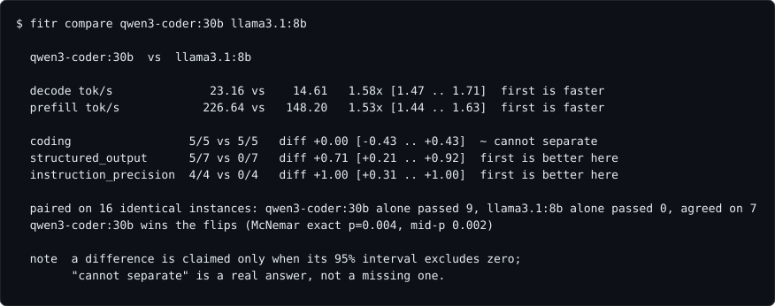
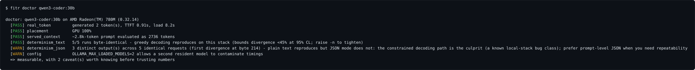

# fitr

**Is this local model any good - *on your machine*?**

A new model drops. You want one answer, in ~15 minutes, that is true for *your*
hardware rather than for someone's A100.

```bash
ollama pull some-new-model:tag
fitr run some-new-model:tag --full
fitr board
```


*(Screenshots use mock data and regenerate from the real renderer via `make
screenshots`, so they cannot drift from what the tool prints.)*

Single static binary. No Python, no venv, no package manager, no runtime.

> `llmfit` tells you what fits. Leaderboards tell you what is smart on
> someone else's machine. **`fitr` tells you what is silently broken on yours**
> - the Q4 that still writes clean prose but emits malformed tool calls, the
> parser that swallows them, the loop your GPU triggers and nobody else's does.

---

## Four design commitments

The first three are becoming industry consensus - `homebench`, `bench-loop`,
`PocketPal` and `llmfit` all partition by hardware now, and Wilson intervals
ship in several local harnesses. We hold them because they are correct, not
because they are rare. The fourth is, as of August 2026, ours alone.

### 1. A score is meaningless without the device it was measured on

The *same model*, *same tag*, on the *same laptop* went from **"crashes on
load"** to **"daily driver"** because of a GPU driver update. Nothing about the
model changed.

Every result embeds a fingerprint - GPU, driver, Ollama version, inference
backend, and the config that actually moves numbers (`OLLAMA_FLASH_ATTENTION`,
`OLLAMA_KV_CACHE_TYPE`). `fitr board` groups by fingerprint and **refuses to
rank across groups**. Change the driver and your old numbers are explicitly void.

### 2. "Is it good" is unanswerable. "Does it serve need X" is answerable.

Independent needs, each with its own gate. A model can serve one brilliantly and
fail another, and one number cannot say that.

| Need | Why separate |
|---|---|
| **fast + pretty good** | responsiveness; TTFT-dominated |
| **great coding / reasoning** | executed assertions plus computed-answer checks, never judged by a model |
| **emits valid structured output** | quantization breaks JSON before prose - the earliest damage signal |
| **follows exact instructions** | verifiable constraints, graded by code |
| **no filtering / low refusal** | a first-class need, not a footnote |
| **works unattended** | prefill-bound, not decode-bound |
| **leaves tools alone when irrelevant** | the most common local tool failure |
| **small enough to keep resident** | measured resident bytes, not file size |
| **reads images** | a capability, not a grade |
| **your tasks** | `~/.fitr/tasks/*.json` - the built-ins are defaults, your work is the point |

Verdicts are **PASS / FAIL / SKIP / n/a / BLKD**. `SKIP` means not measured.
`n/a` means the model never claimed it - a text-only model is not *bad at
vision*. `BLKD` means we could not fairly test it.

### 3. A single run is not a measurement

Identical configs vary **10-20 percentage points** between runs. We watched the
same coding task pass on one run and fail on the next with nothing changed.

So tasks repeat (`-k 3` default), results carry **Wilson score intervals**, and
`fitr compare` says **"INDISTINGUISHABLE on this sample size"** rather than
inventing a winner. A single pass gives a Wilson interval of `[0.21, 1.0]`.

### 4. A model that passes every test can still be broken here

Quantization degrades structured output long before it degrades prose, and
looping is **hardware-specific** - llama.cpp has open 2026 issues tying garbled
output to dual-GPU CUDA but not single, batch 512 but not 1024, Vulkan on
particular gfx IDs, quantized KV cache, and long agentic sessions.

So every run scores the longest text the model produced against **five
independent degeneracy signals** - duplicate paragraph and line ratios, top
n-gram character fraction, gzip compression ratio, and distinct 4-grams. One
signal is not enough: a visibly looping sample scored 0.0 on duplicate
paragraphs because the paragraphs were shorter than the filter.

No other harness reports this. llama.cpp ships DRY and XTC samplers that
*suppress* loops but never *report* them, and two upstream attempts to add
detection stalled or were closed.

---

## Install

```bash
# from source
git clone https://github.com/blisspixel/fitr && cd fitr
make install

# or grab a binary for your platform from Releases
```

Needs Go 1.25+ to build, a running **Ollama or llama-server** to measure, and
`python3` on PATH **only** to execute the Python coding fixtures. The harness
language and the task language are deliberately separate: a task declares the
interpreter it needs in its spec, so adding Rust tasks would need `cargo`, not
a rewrite.

## Backends

`fitr` auto-detects what is running: Ollama at `OLLAMA_BASE_URL` (default
`:11434`), then llama.cpp's `llama-server` at `LLAMA_SERVER_URL` (default
`:8080`), then any **OpenAI-compatible server** - LM Studio, vLLM, SGLang - at
`FITR_OPENAI_URL` (default `:1234`, LM Studio's port). Force one with
`--backend ollama|llama-server|openai`.

On the generic OpenAI backend, honesty notes: timings are **client-derived**
(the surface exposes token counts but no server timings), tool support is
claimed optimistically and then **verified by the plumbing diagnostic** before
any tools verdict, and resident-memory needs SKIP.

The llama-server backend is not just reach - it is measurement surface Ollama
does not expose: per-request **cached-token counts** (the only honest cold/warm
prefill split), and a **capability probe** (`/props`) so tool/vision support is
read from the endpoint, never guessed from the model's name. Resident-memory
needs SKIP on llama-server - it does not report resident bytes, and a made-up
number would be worse than a gap. The runtime and its version are part of the
device fingerprint: a backend change is a different measurement, and `board`
will not rank across it.

## Commands

| Command | Does |
|---|---|
| `fitr run <model> [--quick\|--full] [-k N]` | measure a model on this device |
| `fitr board [--current]` | compare everything, grouped by device |
| `fitr doctor <model> [-n N]` | can this box be measured fairly at all? (~1 min) |
| `fitr diag <model>` | 5-rung tool-use plumbing diagnostic |
| `fitr compare <a> <b>` | difference/ratio intervals; paired flips on shared instances |
| `fitr device` / `fitr profiles` | fingerprint and gates |

| Level | Runs | ~Time |
|---|---|---|
| `--quick` | speed, memory, coding, plumbing, tools | ~4 min |
| *(default)* | + 16 generated checks + refusal battery | ~11 min |
| `--full` | + 40-turn unattended agentic task | ~18 min |

---

## The statistics take small samples seriously

Local benchmarking lives at n=3 to n=50, which is exactly where most benchmark
statistics quietly stop being true. fitr's rules: never fabricate precision,
and "cannot separate" is a real answer. Concretely:

- Every pass rate carries a **Wilson interval**; every run prints its
  **minimum detectable effect** so the sample's resolution is never implied.
- `fitr compare` claims a difference only when the **Newcombe difference
  interval** excludes zero - the folk "intervals overlap, no claim" rule is
  an effective alpha of ~0.006 and silently misses real differences.
- Speed ratios use **Fieller's theorem** (the correct interval for a ratio of
  means), with Welch degrees of freedom, and refuse to print numbers when the
  math degenerates.
- Two runs sharing `--seedset` face **identical generated instances**, so
  compare upgrades to **McNemar's exact test** on the item-level flips - and
  says "too few flips to separate regardless of split" when that is the truth.
- `fitr run --adaptive` repeats checks until each gated need is **decided by
  Wald's SPRT** (the sequential test Stockfish's Fishtest has used for a
  decade) or honestly reports that the sample cannot separate it.
- `fitr doctor`'s "deterministic" claim carries its exact bound: 5 identical
  runs proves divergence is below 45% at 95% confidence, and the output says
  so rather than implying certainty.



Every method, the rejected alternative, and the references are in
**[STATS.md](STATS.md)**.

## `fitr doctor` - is this box even measurable?

Every benchmark silently assumes the stack under it is healthy. Nothing checks.
`fitr doctor <model>` does, in about a minute:



- **A real generated token, not an HTTP 200.** A misconfigured offload can
  accept requests and emit nothing.
- **Determinism, byte-compared.** N identical greedy requests in plain text
  *and* in grammar-constrained JSON mode - which is a different code path and
  is known to break seed reproducibility on some local stacks while plain text
  reproduces. If your box does not reproduce, every single-run number anyone
  quotes at you is noisier than it looks. Nondeterminism is reported as a
  caveat, not a failure: repeats and intervals survive it; one-shot numbers do not.
- **Served context.** A ~2.8K-token probe checks `prompt_eval_count` - the
  receipt for whether the server actually evaluated what you sent.
- **Placement.** `GPU 62%` means partial offload: a RAM-bandwidth benchmark
  wearing a GPU badge.
- **Config red flags** from the server's own log (authoritative over your
  shell's environment): parallel slots divide the context, a second loaded
  model contaminates timings.

## Generated tasks: no answer strings, anywhere

The check battery (JSON emission, schema conformance, tool-argument fidelity,
CSV, format constraints, computed math, date arithmetic, state tracking) is
**generated per run**. Each task is a parameterized family: names, numbers, and
dates come from a seeded RNG, and the correct answer is **computed by the
harness, never stored**. There is no answer string in this repo to leak into
training data, every repeat is a genuinely independent trial for the Wilson
intervals, and each result records its seed so any instance can be regenerated
exactly. The battery also self-tests without a model: every family's computed
canonical answer must pass its own grader.

Grading is strict where strictness is the point - a reply that wraps JSON in
commentary fails `structured_output`, because no pipeline can consume it - and
lenient where it is not: reasoning tasks only require a final `Answer:` line,
so a chatty-but-correct model is not punished for chattiness there.

## Your own tasks, without forking

Drop declarative tasks in `~/.fitr/tasks/*.json` (or `$FITR_TASKS`):

```jsonc
{
  "id": "my_extraction",
  "kind": "check",
  "why": "the shape of my actual workload",
  "family": "static",
  "num_predict": 200,
  "params": {
    "prompt": "Extract the invoice total from: ... Reply with the number only.",
    "grader": { "type": "number", "expected_number": 1249.5, "tolerance": 0.01 }
  }
}
```

Graders: `exact`, `contains`, `regex`, `json_object`, `number`. A user task can
prompt and grade; it **cannot execute anything** - exec-style user tasks stay
out until they can be sandboxed honestly. They score into their own
`your tasks` row (all-must-pass by default), or pool into a built-in need via
`"need"`. Malformed files are hard errors with the filename in them: silently
dropping your own task would defeat the point of having one.

---

## How to read a result

**A `FAIL` is a statement about this model *in this configuration*, not a
verdict on the model.**

### A zero often means "we haven't learned how to talk to it yet"

When a local model appears unable to use tools, roughly **4 times in 5** the
cause is the chat template, the tool-call parser, the quant, or the context size
 -  not the weights. Formats differ wildly (`<tool_call>{json}</tool_call>` vs XML
`<function=name>` vs `<|python_tag|>`), and **the wrong parser produces zero tool
calls and no error at all.**

Not hypothetical: this tool once recorded a model as failing tool use. The
plumbing diagnostic then showed it emits valid calls with valid arguments and
consumes results correctly - it just fires them on irrelevant questions.
*"Can't use tools"* was wrong; *"can't restrain tool use"* was right.

So `run` executes the plumbing diagnostic **before** the tools test. If plumbing
is broken the need is **`BLKD`**, never `FAIL`.

```bash
fitr diag <model>   # run this before believing any tools failure
```

### Not needing a capability is normal

**Most work does not need tool calling.** A model that cannot drive an agent loop
can still be the best thing on your machine for drafting or fast uncensored chat.
Results are a **set of needs served**, not a rank. The tool never prints "not
recommended."

---

## Device profiles

Gates live in `internal/device/profiles/*.json`, embedded in the binary and
auto-selected by matching your GPU or hostname. `default` is deliberately
uncalibrated and says so at runtime.

```jsonc
{
  "name": "lappy",
  "match": { "gpu_contains": "780M" },
  "gates": {
    "fast_chat": {
      "decode_tps_min": 10.0, "ttft_s_max": 1.5,
      "why": "comfortable reading is ~5-6 tok/s; TTFT is what makes it FEEL fast"
    }
  }
}
```

Every threshold carries a `why`. **Copy `default.json`, tune it, set `match`.**
Do not reuse another machine's numbers.

---

## Degeneracy detection

Five independent deterministic signals, no model call: duplicate paragraph /
line ratios, top-4-gram character share, gzip compression ratio, distinct-4-gram.

**Why five and not one:** a local model once produced a 104 KB report that passed
every structural check while 25% of its paragraphs were duplicates - it had
looped one table 11 times. Length correlated *negatively* with quality. And a
single metric has blind spots: on a *short* looping sample the paragraph metric
reads **0.0** while `dup_line_ratio` reads **0.91** and gzip ratio **9.2**.

---

## Output modes and exit codes

```bash
fitr run m --display json    # NDJSON on stdout, nothing else
fitr run m -q                # results only     -v  detail, no progress
NO_COLOR=1 fitr board        # honored (empty string means unset)
FITR_ASCII=1 fitr board   # force ASCII glyphs
```

Progress -> **stderr**, results -> **stdout**, so `fitr run m > out.txt` is
clean. Errors are plain text on stderr even under `--json`; the exit code is the
machine channel.

| Exit | Meaning |
|---|---|
| 0 | ran, every measured need passed |
| 1 | error |
| 2 | usage |
| 3 | ran fine, a need FAILED (use as a CI gate) |
| 130 | interrupted |

## Known limits

- **Small battery.** ~23 binary trials per default run puts the minimum
  detectable effect near 29 pp - and the run *says so*, out loud, every time.
  It separates *broken* from *working*, not *good* from *slightly better*.
  `-k 3` regenerates every check three times and roughly halves the MDE.
- **Burst, not sustained.** A thin laptop throttles under multi-hour load.
- **Shared memory.** On an iGPU the "GPU memory" is system RAM; a resident 19 GB
  model still costs 19 GB of your budget.
- **The refusal battery is 3 prompts.** It detects "will refuse ordinary work",
  not the full alignment surface.
- **One model at a time.** Concurrent models contaminate timings enough to
  invalidate a run; every phase clears residents first.

## Why Go

Not performance - a run is ~99.9% blocked waiting on the model, so the harness
language is irrelevant to runtime. It is **distribution**: one static binary,
no interpreter or package manager on the user's machine, ~10 ms startup, and
trivial cross-compilation for every platform Ollama runs on.

The eval definition lives in `spec/` as language-neutral JSON, so the spec is
the contract and the harness is just glue. The classic tasks were extracted
from a Python reference implementation and are held in lockstep by its tests;
`check` tasks name a parameterized family whose instances - and answers - are
computed at run time from a recorded seed.

## License

MIT
